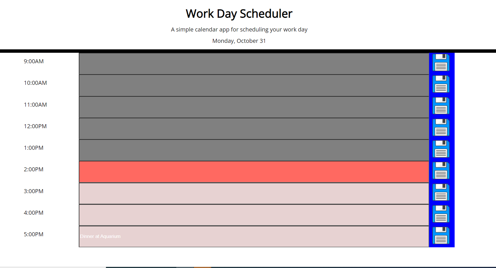
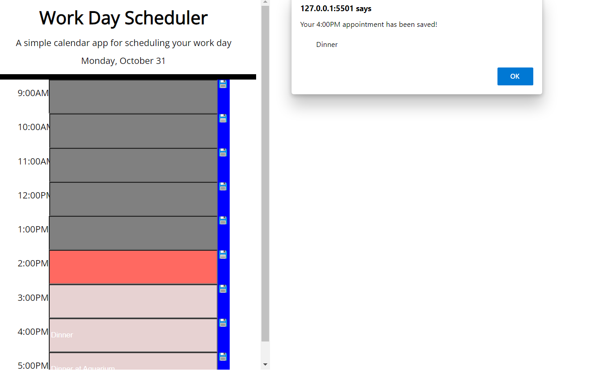
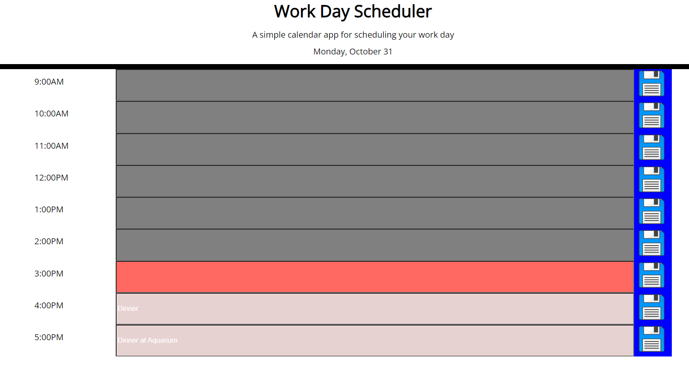

# Work-Day-Schedular-
Created a scheduler that saves appointments to local storage.
Added current day by linking dayjs to html and javascript,
the body was intially made in the html and then moved to javascript to create interactions. 
The body has three different sections. Left side is for time, middle section is for event description and the right section contains an icon to save event to local storage. 

When appointment is saved an alert will show up saying "Your __pm/am appointment has been saved!" 

Alert box disappers and event is saved 

